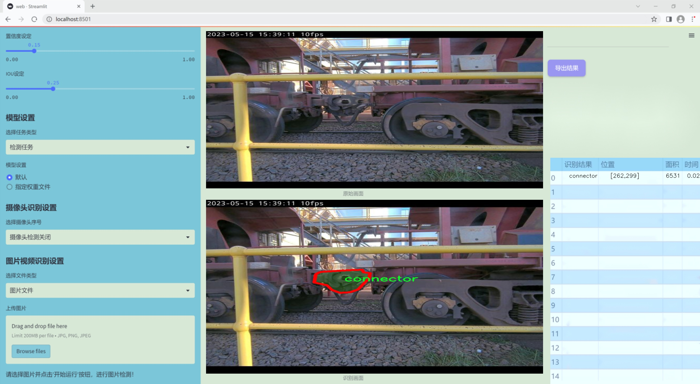
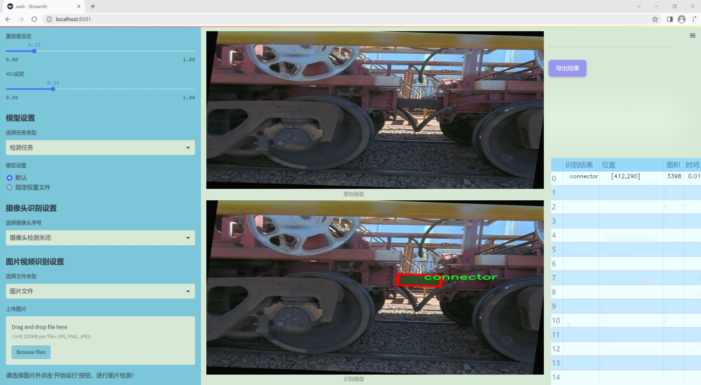
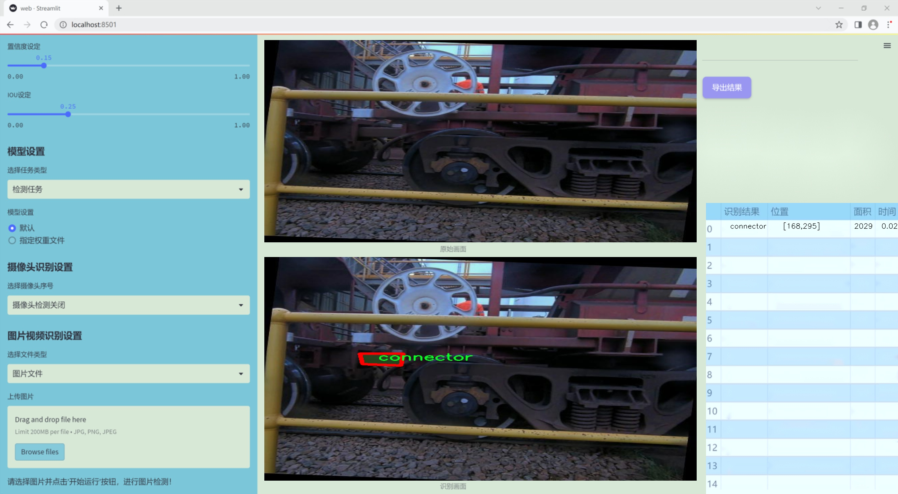
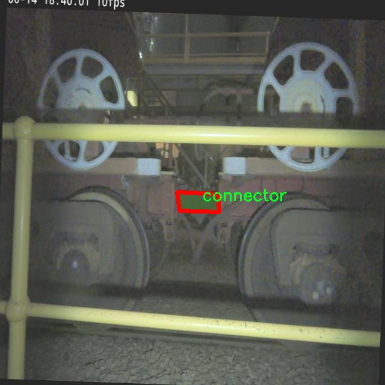
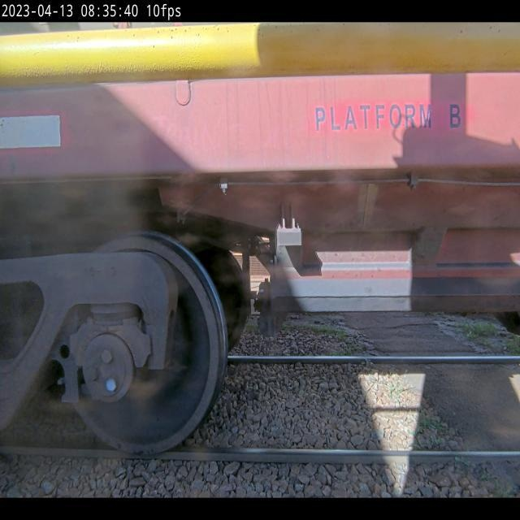
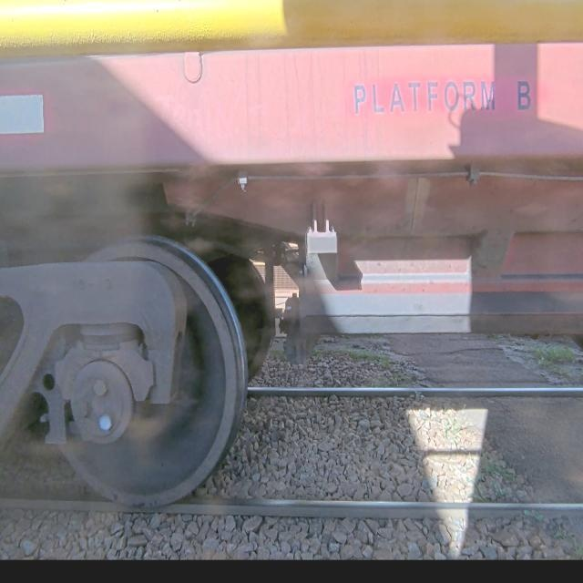
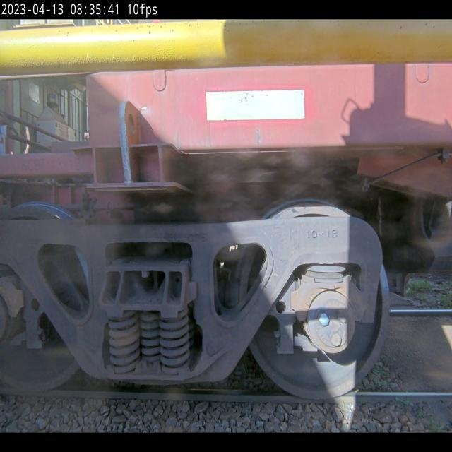
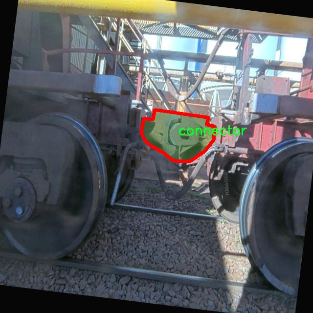

### 1.背景意义

研究背景与意义

随着现代交通运输的快速发展，火车作为一种重要的公共交通工具，其安全性和可靠性日益受到重视。在火车的运行过程中，连接器作为关键的部件之一，负责连接和固定车厢，确保列车的稳定性和安全性。因此，准确、及时地检测火车连接器的状态，对于预防事故、提高运营效率具有重要意义。传统的人工检测方法不仅耗时耗力，而且容易受到人为因素的影响，导致检测结果的不准确性。因此，开发一种基于计算机视觉的自动检测系统，能够有效提升火车连接器的检测效率和准确性，具有重要的实际应用价值。

近年来，深度学习技术的快速发展为计算机视觉领域带来了革命性的变化。YOLO（You Only Look Once）系列模型因其高效的实时目标检测能力，广泛应用于各类视觉识别任务。YOLOv11作为该系列的最新版本，结合了更为先进的网络结构和算法优化，能够在复杂环境中实现更高的检测精度和速度。通过对YOLOv11进行改进，针对火车连接器的特定特征进行优化，可以进一步提升其在实际应用中的表现。

本研究旨在基于改进的YOLOv11模型，构建一个高效的火车连接器检测系统。为此，我们使用了包含1400张图像的Train3数据集，该数据集专门针对连接器和火车两个类别进行了标注。通过对该数据集的深入分析和模型训练，我们期望能够实现对火车连接器的高效检测，进而为火车安全运营提供有力的技术支持。此外，该系统的成功实施将为其他类似的工业检测任务提供借鉴，推动计算机视觉技术在交通运输领域的广泛应用。

### 2.视频效果

[2.1 视频效果](https://www.bilibili.com/video/BV1DFkRYSELf/)

### 3.图片效果







##### [项目涉及的源码数据来源链接](https://kdocs.cn/l/cszuIiCKVNis)**

注意：本项目提供训练的数据集和训练教程,由于版本持续更新,暂不提供权重文件（best.pt）,请按照6.训练教程进行训练后实现上图演示的效果。

### 4.数据集信息

##### 4.1 本项目数据集类别数＆类别名

nc: 2
names: ['connector', 'train']


该项目为【图像分割】数据集，请在【训练教程和Web端加载模型教程（第三步）】这一步的时候按照【图像分割】部分的教程来训练

##### 4.2 本项目数据集信息介绍

本项目数据集信息介绍

本项目旨在改进YOLOv11的火车连接器检测系统，所使用的数据集名为“Train3”。该数据集专注于火车连接器及其相关部件的检测，具有重要的实际应用价值。数据集中包含两类主要对象，分别为“connector”和“train”。这两类对象的选择不仅反映了火车运行的基本构成要素，也为系统的准确性和鲁棒性提供了坚实的基础。

在数据集的构建过程中，研究团队收集了大量高质量的图像数据，涵盖了不同环境、光照条件和角度下的火车连接器和火车本体。这些图像不仅展示了连接器的多样性，还包括了火车在不同状态下的特征，确保了数据集的全面性和代表性。为了增强模型的训练效果，数据集中的图像经过精心标注，确保每个连接器和火车的实例都被准确识别和定位。

此外，数据集的设计考虑到了实际应用中的各种挑战，例如连接器在复杂背景下的识别难度以及不同火车类型的多样性。这种多样化的样本选择将有助于提升YOLOv11模型在实际场景中的适应能力和检测精度。通过对“Train3”数据集的深入分析和训练，期望能够显著提高火车连接器的检测效率，为火车安全运行提供更为可靠的技术支持。

总之，本项目的数据集“Train3”不仅在类别上涵盖了火车连接器和火车本体的关键元素，还在数据质量和多样性方面进行了严格把控，为改进YOLOv11的火车连接器检测系统奠定了坚实的基础。











### 5.全套项目环境部署视频教程（零基础手把手教学）

[5.1 所需软件PyCharm和Anaconda安装教程（第一步）](https://www.bilibili.com/video/BV1BoC1YCEKi/?spm_id_from=333.999.0.0&vd_source=bc9aec86d164b67a7004b996143742dc)


[5.2 安装Python虚拟环境创建和依赖库安装视频教程（第二步）](https://www.bilibili.com/video/BV1ZoC1YCEBw?spm_id_from=333.788.videopod.sections&vd_source=bc9aec86d164b67a7004b996143742dc)

### 6.改进YOLOv11训练教程和Web_UI前端加载模型教程（零基础手把手教学）

[6.1 改进YOLOv11训练教程和Web_UI前端加载模型教程（第三步）](https://www.bilibili.com/video/BV1BoC1YCEhR?spm_id_from=333.788.videopod.sections&vd_source=bc9aec86d164b67a7004b996143742dc)


按照上面的训练视频教程链接加载项目提供的数据集，运行train.py即可开始训练



     Epoch   gpu_mem       box       obj       cls    labels  img_size
     1/200     20.8G   0.01576   0.01955  0.007536        22      1280: 100%|██████████| 849/849 [14:42<00:00,  1.04s/it]
               Class     Images     Labels          P          R     mAP@.5 mAP@.5:.95: 100%|██████████| 213/213 [01:14<00:00,  2.87it/s]
                 all       3395      17314      0.994      0.957      0.0957      0.0843

     Epoch   gpu_mem       box       obj       cls    labels  img_size
     2/200     20.8G   0.01578   0.01923  0.007006        22      1280: 100%|██████████| 849/849 [14:44<00:00,  1.04s/it]
               Class     Images     Labels          P          R     mAP@.5 mAP@.5:.95: 100%|██████████| 213/213 [01:12<00:00,  2.95it/s]
                 all       3395      17314      0.996      0.956      0.0957      0.0845

     Epoch   gpu_mem       box       obj       cls    labels  img_size
     3/200     20.8G   0.01561    0.0191  0.006895        27      1280: 100%|██████████| 849/849 [10:56<00:00,  1.29it/s]
               Class     Images     Labels          P          R     mAP@.5 mAP@.5:.95: 100%|███████   | 187/213 [00:52<00:00,  4.04it/s]
                 all       3395      17314      0.996      0.957      0.0957      0.0845


###### [项目数据集下载链接](https://kdocs.cn/l/cszuIiCKVNis)

### 7.原始YOLOv11算法讲解


###### YOLOv11改进方向

与YOLOv 10相比，YOLOv 11有了巨大的改进，包括但不限于：

  * 增强的模型结构：模型具有改进的模型结构，以获取图像处理并形成预测
  * GPU优化：这是现代ML模型的反映，GPU训练ML模型在速度和准确性上都更好。
  * 速度：YOLOv 11模型现在经过增强和GPU优化以用于训练。通过优化，这些模型比它们的前版本快得多。在速度上达到了25%的延迟减少！
  * 更少的参数：更少的参数允许更快的模型，但v11的准确性不受影响
  * 更具适应性：更多支持的任务YOLOv 11支持多种类型的任务、多种类型的对象和多种类型的图像。

###### YOLOv11功能介绍

Glenn Jocher和他的团队制作了一个令人敬畏的YOLOv 11迭代，并且在图像人工智能的各个方面都提供了YOLO。YOLOv 11有多种型号，包括：

  * 对象检测-在训练时检测图像中的对象
  * 图像分割-超越对象检测，分割出图像中的对象
  * 姿态检测-当用点和线训练时绘制一个人的姿势
  * 定向检测（OBB）：类似于对象检测，但包围盒可以旋转
  * 图像分类-在训练时对图像进行分类

使用Ultralytics Library，这些模型还可以进行优化，以：

  * 跟踪-可以跟踪对象的路径
  * 易于导出-库可以以不同的格式和目的导出
  * 多场景-您可以针对不同的对象和图像训练模型

此外，Ultralytics还推出了YOLOv 11的企业模型，该模型将于10月31日发布。这将与开源的YOLOv
11模型并行，但将拥有更大的专有Ultralytics数据集。YOLOv 11是“建立在过去的成功”的其他版本的之上。

###### YOLOv11模型介绍

YOLOv 11附带了边界框模型（无后缀），实例分割（-seg），姿态估计（-pose），定向边界框（-obb）和分类（-cls）。

这些也有不同的尺寸：纳米（n），小（s），中（m），大（l），超大（x）。


YOLOv11模型

###### YOLOv11与前版本对比

与YOLOv10和YOLOv8相比，YOLOv11在Ultralytics的任何帖子中都没有直接提到。所以我会收集所有的数据来比较它们。感谢Ultralytics：

**检测：**


YOLOv11检测统计


YOLOv10检测统计

其中，Nano的mAPval在v11上为39.5，v10上为38.5；Small为47.0 vs 46.3，Medium为51.5 vs
51.1，Large为53.4 vs 53.2，Extra Large为54.7vs
54.4。现在，这可能看起来像是一种增量增加，但小小数的增加可能会对ML模型产生很大影响。总体而言，YOLOv11以0.3
mAPval的优势追平或击败YOLOv10。

现在，我们必须看看速度。在延迟方面，Nano在v11上为1.55 , v10上为1.84，Small为2.46 v2.49，Medium为4.70
v4.74，Large为6.16 v7.28，Extra Large为11.31
v10.70。延迟越低越好。YOLOv11提供了一个非常低的延迟相比，除了特大做得相当差的前身。

总的来说，Nano模型是令人振奋的，速度更快，性能相当。Extra Large在性能上有很好的提升，但它的延迟非常糟糕。

**分割：**


YOLOV11 分割统计


YOLOV9 分割统计


YOLOV8 分割数据

总体而言，YOLOv 11上的分割模型在大型和超大型模型方面比上一代YOLOv 8和YOLOv 9做得更好。

YOLOv 9 Segmentation没有提供任何关于延迟的统计数据。比较YOLOv 11延迟和YOLOv 8延迟，发现YOLOv 11比YOLOv
8快得多。YOLOv 11将大量GPU集成到他们的模型中，因此期望他们的模型甚至比CPU测试的基准更快！

姿态估计：


YOLOV11姿态估计统计


YOLOV8姿态估计统计

YOLOv 11的mAP 50 -95统计量也逐渐优于先前的YOLOv 8（除大型外）。然而，在速度方面，YOLOv
11姿势可以最大限度地减少延迟。其中一些延迟指标是版本的1/4！通过对这些模型进行GPU训练优化，我可以看到指标比显示的要好得多。

**定向边界框：**


YOLOv11 OBB统计


YOLOv8 OBB统计

OBB统计数据在mAP
50上并不是很好，只有非常小的改进，在某种程度上小于检测中的微小改进。然而，从v8到v11的速度减半，这表明YOLOv11在速度上做了很多努力。

**最后，分类：**


YOLOv 11 CLS统计


YOLOv8 CLS统计

从v8到v11，准确性也有了微小的提高。然而，速度大幅上升，CPU速度更快的型号。


### 8.200+种全套改进YOLOV11创新点原理讲解

#### 8.1 200+种全套改进YOLOV11创新点原理讲解大全

由于篇幅限制，每个创新点的具体原理讲解就不全部展开，具体见下列网址中的改进模块对应项目的技术原理博客网址【Blog】（创新点均为模块化搭建，原理适配YOLOv5~YOLOv11等各种版本）

[改进模块技术原理博客【Blog】网址链接](https://gitee.com/qunmasj/good)


#### 8.2 精选部分改进YOLOV11创新点原理讲解

###### 这里节选部分改进创新点展开原理讲解(完整的改进原理见上图和[改进模块技术原理博客链接](https://gitee.com/qunmasj/good)【如果此小节的图加载失败可以通过CSDN或者Github搜索该博客的标题访问原始博客，原始博客图片显示正常】

### ParC融合位置感知循环卷积简介
ParC：Position aware circular convolution


#### Position aware circular convolution
针对于全局信息的提取作者提出了Position aware circular convolution（也称作Global Circular Convolution）。图中左右实际是对于该操作水平竖直两方向的对称，理解时只看左边即可。对于维度为C*H*W的输入，作者先将维度为C*B*1的Position Embedding通过双线性插值函数F调整到适合input的维度C*H*1（以适应不同特征大小输入），并且将PE水平复制扩展到C*H*W维度与输入特征相加。这里作者将PE直接设置成为了可学习的参数。

接下来参考该博客将加入PE的特征图竖直方向堆叠，并且同样以插值的方式得到了适应输入维度的C*H*1大小的卷积核，进行卷积操作。对于这一步卷积，作者将之称为循环卷积，并给出了一个卷积示意图。


但个人感觉实际上这个示意图只是为了说明为什么叫循环卷积，对于具体的计算细节还是根据公式理解更好。


进一步，作者给出了这一步的伪代码来便于读者对这一卷积的理解：y=F.conv2D（torch.cat（xp，xp，dim=2），kV），实际上就是将xp堆叠之后使用了一个“条形（或柱形）”卷积核进行简单的卷积操作。（但这样会导致多一次重复卷积，因此在堆叠示意图中只取了前2*H-1行）

可以看到在示意图中特征维度变化如下：C*(2H-1)*W ---C*H*1--->C*H*W，作者特意带上了通道数，并且并没有出现通道数的改变，那么这里所进行的卷积应该是depth wise卷积，通过对文章后续以及论文源码的阅读可以得知这一步进行的就是DW卷积。（we introduce group convolution and point wise convolution into these modules, which decreases number of parameters without hurting performance.）


由groups = channel可知使用的是DW卷积
通过上面就完成了一次竖直方向的全局信息交流，同样只要在水平方向进行同样的操作即可做到水平方向的全局信息交流。

#### ParC block

通过ParC成功解决了全局信息提取的问题，接下来就是针对2）3）两点进行改进。首先是Meta-Former模块，Meta-Former由Token Mixer和Channel Mixer构成，ParC首先满足了Token Mixer的全局信息提取的要求，并且相较于Attention在计算成本上更低。


这里①中的PWC即point wise conv，进一步验证了我们前面对于深度可分离卷积的想法，而GCC-H/V即是前面所说的ParC-H/V。

①构建了Meta-Former中的Token mixer模块，那么最后剩下的问题就是3），替换掉Attention模块之后模型不再data driven。为了解决这一点作者给出了一个channel wise attention，先将特征图（x,C*H*W）进行global average（a,C*1*1）并输入一个MLP生成一个channel wise的权重（w,C*1*1），再将权重与特征图在通道方向相乘得到输出（output = wx,C*H*W）。

#### ParC net
对于ParC net 的搭建，作者直接基于MobileViT，采用了分叉结构（c）完成了网络的搭建。


具体而言作者保留了MobileViT中浅层具有局部感受野的MobileNetV2结构，而将网络深层的ViT block替换成了ParC block，使网络变成了一个pure ConvNet。


### 9.系统功能展示

图9.1.系统支持检测结果表格显示

  图9.2.系统支持置信度和IOU阈值手动调节

  图9.3.系统支持自定义加载权重文件best.pt(需要你通过步骤5中训练获得)

  图9.4.系统支持摄像头实时识别

  图9.5.系统支持图片识别

  图9.6.系统支持视频识别

  图9.7.系统支持识别结果文件自动保存

  图9.8.系统支持Excel导出检测结果数据


### 10. YOLOv11核心改进源码讲解

#### 10.1 revcol.py

以下是经过精简和注释的核心代码部分：

```python
import torch
import torch.nn as nn

# 定义反向传播的自定义函数
class ReverseFunction(torch.autograd.Function):
    @staticmethod
    def forward(ctx, run_functions, alpha, *args):
        # 保存运行的函数和alpha参数
        ctx.run_functions = run_functions
        ctx.alpha = alpha
        
        # 获取输入参数
        x, c0, c1, c2, c3 = args
        
        # 使用运行的函数计算输出
        c0 = run_functions[0](x, c1) + c0 * alpha[0]
        c1 = run_functions[1](c0, c2) + c1 * alpha[1]
        c2 = run_functions[2](c1, c3) + c2 * alpha[2]
        c3 = run_functions[3](c2, None) + c3 * alpha[3]
        
        # 保存中间结果以便反向传播使用
        ctx.save_for_backward(x, c0, c1, c2, c3)
        return x, c0, c1, c2, c3

    @staticmethod
    def backward(ctx, *grad_outputs):
        # 获取保存的中间结果
        x, c0, c1, c2, c3 = ctx.saved_tensors
        run_functions = ctx.run_functions
        alpha = ctx.alpha
        
        # 反向传播计算梯度
        g3_up = grad_outputs[4]
        g3_left = g3_up * alpha[3]
        # 计算 c3 的梯度
        oup3 = run_functions[3](c2, None)
        torch.autograd.backward(oup3, g3_up, retain_graph=True)
        
        # 继续计算 c2, c1, c0 的梯度
        # 省略了中间步骤以简化代码
        # ...
        
        return None, None, gx_up, g0_left, g1_left, g2_left, g3_left

# 定义网络的基本单元
class SubNet(nn.Module):
    def __init__(self, channels, layers, kernel, first_col, save_memory) -> None:
        super().__init__()
        self.alpha0 = nn.Parameter(torch.ones((1, channels[0], 1, 1)), requires_grad=True)
        self.alpha1 = nn.Parameter(torch.ones((1, channels[1], 1, 1)), requires_grad=True)
        self.alpha2 = nn.Parameter(torch.ones((1, channels[2], 1, 1)), requires_grad=True)
        self.alpha3 = nn.Parameter(torch.ones((1, channels[3], 1, 1)), requires_grad=True)

        # 定义网络的各个层
        self.level0 = Level(0, channels, layers, kernel, first_col)
        self.level1 = Level(1, channels, layers, kernel, first_col)
        self.level2 = Level(2, channels, layers, kernel, first_col)
        self.level3 = Level(3, channels, layers, kernel, first_col)

    def forward(self, *args):
        # 根据是否保存内存选择前向传播方式
        if self.save_memory:
            return self._forward_reverse(*args)
        else:
            return self._forward_nonreverse(*args)

# 定义整个网络结构
class RevCol(nn.Module):
    def __init__(self, kernel='C2f', channels=[32, 64, 96, 128], layers=[2, 3, 6, 3], num_subnet=5, save_memory=True) -> None:
        super().__init__()
        self.num_subnet = num_subnet
        self.channels = channels
        self.layers = layers

        # 定义输入层
        self.stem = Conv(3, channels[0], k=4, s=4, p=0)

        # 定义多个子网络
        for i in range(num_subnet):
            first_col = (i == 0)
            self.add_module(f'subnet{i}', SubNet(channels, layers, kernel, first_col, save_memory))

    def forward(self, x):
        # 前向传播过程
        c0, c1, c2, c3 = 0, 0, 0, 0
        x = self.stem(x)        
        for i in range(self.num_subnet):
            c0, c1, c2, c3 = getattr(self, f'subnet{i}')(x, c0, c1, c2, c3)       
        return [c0, c1, c2, c3]
```

### 代码注释说明：
1. **ReverseFunction**: 这是一个自定义的反向传播函数，负责在前向传播时保存中间结果，并在反向传播时计算梯度。
2. **SubNet**: 这是一个子网络模块，包含多个层和参数（alpha），根据是否保存内存选择不同的前向传播方式。
3. **RevCol**: 这是整个网络的结构，包含输入层和多个子网络，负责处理输入数据并返回多个输出。

通过这样的精简和注释，代码的核心逻辑得以保留，同时也更易于理解。

这个程序文件 `revcol.py` 是一个使用 PyTorch 框架实现的深度学习模型，主要用于图像处理任务。它包含了多个类和函数，构成了一个复杂的神经网络结构，特别是针对反向传播和内存优化进行了设计。

首先，文件导入了必要的 PyTorch 模块和自定义模块。`get_gpu_states` 和 `get_gpu_device` 函数用于获取当前 GPU 的随机数生成状态和设备信息，这对于多 GPU 训练非常重要。`set_device_states` 函数则用于设置这些状态，确保在训练过程中各个设备的状态一致。

`detach_and_grad` 函数用于处理输入的张量，确保它们在计算图中正确地分离和保持梯度。`get_cpu_and_gpu_states` 函数则获取 CPU 和 GPU 的随机数生成状态。

接下来是 `ReverseFunction` 类，它是一个自定义的 PyTorch 自动求导函数。它的 `forward` 方法实现了一个前向传播过程，使用了多个传入的函数和参数来计算输出，并保存了一些中间状态以供反向传播使用。`backward` 方法则实现了反向传播的逻辑，利用保存的状态和输入的梯度来计算每一层的梯度。

`Fusion` 类和 `Level` 类分别实现了特征融合和层级结构的构建。`Fusion` 类根据当前层级的不同选择不同的上采样或下采样方式。`Level` 类则构建了由多个卷积块组成的层。

`SubNet` 类是一个子网络的实现，包含了多个层级的处理逻辑。它根据是否保存内存的标志，选择使用反向传播或非反向传播的方式进行前向计算。它还包含了对缩放因子的管理，确保这些因子在训练过程中保持在合理的范围内。

最后，`RevCol` 类是整个模型的顶层结构，初始化了多个子网络，并在前向传播中依次调用这些子网络。它的设计允许通过调整参数来控制网络的复杂度和性能。

总体而言，这个文件实现了一个高效的图像处理神经网络，特别是在反向传播和内存管理方面进行了优化，适合在大规模数据集上进行训练。

#### 10.2 kacn_conv.py

以下是代码中最核心的部分，并附上详细的中文注释：

```python
import torch
import torch.nn as nn

class KACNConvNDLayer(nn.Module):
    def __init__(self, conv_class, norm_class, input_dim, output_dim, degree, kernel_size,
                 groups=1, padding=0, stride=1, dilation=1,
                 ndim: int = 2, dropout=0.0):
        super(KACNConvNDLayer, self).__init__()
        
        # 初始化输入和输出维度、卷积参数等
        self.inputdim = input_dim  # 输入通道数
        self.outdim = output_dim    # 输出通道数
        self.degree = degree         # 多项式的度数
        self.kernel_size = kernel_size  # 卷积核大小
        self.padding = padding       # 填充
        self.stride = stride         # 步幅
        self.dilation = dilation     # 膨胀
        self.groups = groups         # 分组卷积的组数
        self.ndim = ndim             # 数据的维度（1D, 2D, 3D）
        self.dropout = None          # dropout层初始化为None

        # 如果dropout大于0，则根据维度选择相应的dropout层
        if dropout > 0:
            if ndim == 1:
                self.dropout = nn.Dropout1d(p=dropout)
            elif ndim == 2:
                self.dropout = nn.Dropout2d(p=dropout)
            elif ndim == 3:
                self.dropout = nn.Dropout3d(p=dropout)

        # 检查groups参数的有效性
        if groups <= 0:
            raise ValueError('groups must be a positive integer')
        if input_dim % groups != 0:
            raise ValueError('input_dim must be divisible by groups')
        if output_dim % groups != 0:
            raise ValueError('output_dim must be divisible by groups')

        # 为每个组创建归一化层
        self.layer_norm = nn.ModuleList([norm_class(output_dim // groups) for _ in range(groups)])

        # 创建多项式卷积层
        self.poly_conv = nn.ModuleList([conv_class((degree + 1) * input_dim // groups,
                                                   output_dim // groups,
                                                   kernel_size,
                                                   stride,
                                                   padding,
                                                   dilation,
                                                   groups=1,
                                                   bias=False) for _ in range(groups)])
        
        # 注册一个缓冲区，用于存储多项式的系数
        arange_buffer_size = (1, 1, -1,) + tuple(1 for _ in range(ndim))
        self.register_buffer("arange", torch.arange(0, degree + 1, 1).view(*arange_buffer_size))
        
        # 使用Kaiming均匀分布初始化卷积层的权重
        for conv_layer in self.poly_conv:
            nn.init.normal_(conv_layer.weight, mean=0.0, std=1 / (input_dim * (degree + 1) * kernel_size ** ndim))

    def forward_kacn(self, x, group_index):
        # 前向传播函数，处理每个组的输入
        x = torch.tanh(x)  # 应用tanh激活函数
        x = x.acos().unsqueeze(2)  # 计算反余弦并增加一个维度
        x = (x * self.arange).flatten(1, 2)  # 与多项式系数相乘并展平
        x = x.cos()  # 计算余弦值
        x = self.poly_conv[group_index](x)  # 通过对应的卷积层
        x = self.layer_norm[group_index](x)  # 归一化
        if self.dropout is not None:
            x = self.dropout(x)  # 应用dropout
        return x

    def forward(self, x):
        # 前向传播函数，处理所有组的输入
        split_x = torch.split(x, self.inputdim // self.groups, dim=1)  # 按组分割输入
        output = []
        for group_ind, _x in enumerate(split_x):
            y = self.forward_kacn(_x.clone(), group_ind)  # 对每个组调用forward_kacn
            output.append(y.clone())  # 保存输出
        y = torch.cat(output, dim=1)  # 将所有组的输出拼接
        return y
```

### 代码说明：
1. **KACNConvNDLayer**：这是一个自定义的卷积层，支持任意维度的卷积操作。它允许使用多项式卷积，并通过归一化和dropout层来增强模型的表现。
2. **构造函数**：初始化卷积层的参数，包括输入输出维度、卷积核大小、分组数等，并创建相应的卷积和归一化层。
3. **forward_kacn**：实现了每个组的前向传播逻辑，包括激活函数、卷积操作和归一化。
4. **forward**：实现了整个层的前向传播逻辑，首先将输入按组分割，然后对每个组调用`forward_kacn`进行处理，最后将结果拼接。

这个程序文件定义了一个名为 `kacn_conv.py` 的模块，主要用于实现一种新的卷积层，称为 KACN（Kacn Activation Convolutional Network）卷积层。该模块利用 PyTorch 框架，包含了多维卷积层的基本结构，支持一维、二维和三维卷积操作。

首先，程序导入了 PyTorch 的核心库和神经网络模块。接着，定义了一个名为 `KACNConvNDLayer` 的类，继承自 `nn.Module`。这个类的构造函数接受多个参数，包括卷积类型、归一化类型、输入和输出维度、卷积核大小、组数、填充、步幅、扩张、维度数量和 dropout 概率等。

在构造函数中，首先对输入参数进行初始化，并检查组数是否为正整数，以及输入和输出维度是否能被组数整除。接着，创建了一个归一化层的模块列表，使用指定的归一化类，并为每个组初始化一个卷积层，使用指定的卷积类。这里的卷积层的输入通道数是 `(degree + 1) * input_dim // groups`，输出通道数是 `output_dim // groups`。

接下来，程序注册了一个名为 `arange` 的缓冲区，用于存储从 0 到 `degree` 的数值，并为卷积层的权重初始化了 Kaiming 正态分布，以便在训练开始时有更好的表现。

`forward_kacn` 方法实现了 KACN 的前向传播逻辑。它首先对输入进行激活，然后进行线性变换，接着通过卷积层和归一化层处理，并在需要时应用 dropout。

`forward` 方法则实现了整体的前向传播过程。它将输入按组分割，并对每个组调用 `forward_kacn` 方法，最后将所有组的输出拼接在一起。

此外，程序还定义了三个子类：`KACNConv3DLayer`、`KACNConv2DLayer` 和 `KACNConv1DLayer`，分别用于实现三维、二维和一维的 KACN 卷积层。这些子类在初始化时调用了父类的构造函数，并传入相应的卷积和归一化类。

总体而言，这个程序文件提供了一种灵活的卷积层实现，支持多种维度的卷积操作，并通过 KACN 方法增强了卷积层的表现能力。

#### 10.3 rmt.py

以下是代码中最核心的部分，并附上详细的中文注释：

```python
import torch
import torch.nn as nn
import torch.nn.functional as F

class DWConv2d(nn.Module):
    """ 深度可分离卷积类 """
    def __init__(self, dim, kernel_size, stride, padding):
        super().__init__()
        # 使用深度可分离卷积，groups=dim表示每个输入通道都独立卷积
        self.conv = nn.Conv2d(dim, dim, kernel_size, stride, padding, groups=dim)

    def forward(self, x: torch.Tensor):
        '''
        x: 输入张量，形状为 (b, h, w, c)
        '''
        x = x.permute(0, 3, 1, 2)  # 转换为 (b, c, h, w)
        x = self.conv(x)  # 进行卷积操作
        x = x.permute(0, 2, 3, 1)  # 转换回 (b, h, w, c)
        return x

class MaSA(nn.Module):
    """ 多头自注意力机制类 """
    def __init__(self, embed_dim, num_heads, value_factor=1):
        super().__init__()
        self.factor = value_factor
        self.embed_dim = embed_dim
        self.num_heads = num_heads
        self.head_dim = self.embed_dim * self.factor // num_heads  # 每个头的维度
        self.key_dim = self.embed_dim // num_heads  # 键的维度
        self.scaling = self.key_dim ** -0.5  # 缩放因子
        # 定义线性变换层
        self.q_proj = nn.Linear(embed_dim, embed_dim, bias=True)
        self.k_proj = nn.Linear(embed_dim, embed_dim, bias=True)
        self.v_proj = nn.Linear(embed_dim, embed_dim * self.factor, bias=True)
        self.lepe = DWConv2d(embed_dim, 5, 1, 2)  # 位置编码卷积
        self.out_proj = nn.Linear(embed_dim * self.factor, embed_dim, bias=True)  # 输出层
        self.reset_parameters()  # 初始化参数

    def reset_parameters(self):
        # 使用Xavier初始化权重
        nn.init.xavier_normal_(self.q_proj.weight, gain=2 ** -2.5)
        nn.init.xavier_normal_(self.k_proj.weight, gain=2 ** -2.5)
        nn.init.xavier_normal_(self.v_proj.weight, gain=2 ** -2.5)
        nn.init.xavier_normal_(self.out_proj.weight)
        nn.init.constant_(self.out_proj.bias, 0.0)

    def forward(self, x: torch.Tensor, rel_pos):
        '''
        x: 输入张量，形状为 (b, h, w, c)
        rel_pos: 位置关系的掩码
        '''
        bsz, h, w, _ = x.size()  # 获取输入的批次大小和高度宽度

        # 线性变换生成查询、键、值
        q = self.q_proj(x)
        k = self.k_proj(x)
        v = self.v_proj(x)
        lepe = self.lepe(v)  # 位置编码

        k *= self.scaling  # 对键进行缩放
        # 重塑查询和键的形状以便进行多头注意力计算
        qr = q.view(bsz, h, w, self.num_heads, self.key_dim).permute(0, 3, 1, 2, 4)  # (b, n, h, w, d1)
        kr = k.view(bsz, h, w, self.num_heads, self.key_dim).permute(0, 3, 1, 2, 4)  # (b, n, h, w, d1)

        # 计算注意力权重
        qk_mat = qr @ kr.transpose(-1, -2)  # (b, n, h, w, h)
        qk_mat = qk_mat + rel_pos  # 加上位置关系
        qk_mat = torch.softmax(qk_mat, -1)  # 计算softmax得到注意力权重

        # 计算输出
        output = torch.matmul(qk_mat, v)  # (b, n, h, w, d2)
        output = output + lepe  # 加上位置编码
        output = self.out_proj(output.flatten(2, 3))  # 线性变换输出
        return output

class FeedForwardNetwork(nn.Module):
    """ 前馈神经网络类 """
    def __init__(self, embed_dim, ffn_dim, activation_fn=F.gelu, dropout=0.0):
        super().__init__()
        self.fc1 = nn.Linear(embed_dim, ffn_dim)  # 第一层线性变换
        self.fc2 = nn.Linear(ffn_dim, embed_dim)  # 第二层线性变换
        self.dropout = nn.Dropout(dropout)  # dropout层
        self.activation_fn = activation_fn  # 激活函数

    def forward(self, x: torch.Tensor):
        '''
        x: 输入张量，形状为 (b, h, w, c)
        '''
        x = self.fc1(x)  # 第一层
        x = self.activation_fn(x)  # 激活
        x = self.dropout(x)  # dropout
        x = self.fc2(x)  # 第二层
        return x

class VisRetNet(nn.Module):
    """ 可视化回归网络类 """
    def __init__(self, in_chans=3, num_classes=1000, embed_dims=[96, 192, 384, 768], depths=[2, 2, 6, 2], num_heads=[3, 6, 12, 24]):
        super().__init__()
        self.patch_embed = PatchEmbed(in_chans=in_chans, embed_dim=embed_dims[0])  # 图像嵌入层
        self.layers = nn.ModuleList()  # 存储网络层
        for i_layer in range(len(depths)):
            layer = BasicLayer(embed_dim=embed_dims[i_layer], depth=depths[i_layer], num_heads=num_heads[i_layer])
            self.layers.append(layer)  # 添加层到网络

    def forward(self, x):
        x = self.patch_embed(x)  # 嵌入图像
        for layer in self.layers:
            x = layer(x)  # 通过每一层
        return x  # 返回特征

# 示例模型创建
def RMT_T():
    model = VisRetNet(
        embed_dims=[64, 128, 256, 512],
        depths=[2, 2, 8, 2],
        num_heads=[4, 4, 8, 16]
    )
    return model

if __name__ == '__main__':
    model = RMT_T()  # 创建模型
    inputs = torch.randn((1, 3, 640, 640))  # 随机输入
    res = model(inputs)  # 前向传播
    print(res.size())  # 输出结果的尺寸
```

### 代码说明：
1. **DWConv2d**: 实现了深度可分离卷积，用于对输入特征进行卷积操作。
2. **MaSA**: 实现了多头自注意力机制，能够处理输入特征并考虑位置关系。
3. **FeedForwardNetwork**: 实现了前馈神经网络，包含两层线性变换和激活函数。
4. **VisRetNet**: 主网络结构，负责将输入图像嵌入并通过多个层进行处理。
5. **RMT_T**: 创建一个小型的可视化回归网络模型的函数。

这些类和函数共同构成了一个深度学习模型的基础架构，能够处理图像数据并进行特征提取。

这个程序文件 `rmt.py` 实现了一个视觉变换器（Vision Transformer）模型，名为 `VisRetNet`，并定义了一系列相关的模块和功能。程序中使用了 PyTorch 框架，主要包括以下几个部分：

首先，文件导入了必要的库，包括 PyTorch 的核心模块、神经网络模块以及一些实用工具。然后，定义了一些基础的神经网络组件，如 `DWConv2d`（深度可分离卷积）、`RelPos2d`（二维相对位置编码）、`MaSAd` 和 `MaSA`（多头自注意力机制的变体），以及前馈网络 `FeedForwardNetwork`。

`DWConv2d` 类实现了深度可分离卷积，通过对输入的通道进行分组卷积来减少参数量和计算量。`RelPos2d` 类用于生成相对位置编码，这在处理图像时非常重要，因为它可以帮助模型理解像素之间的相对位置关系。`MaSAd` 和 `MaSA` 类则实现了不同形式的多头自注意力机制，前者支持分块的递归计算，后者则是整体计算。

接下来，`RetBlock` 类实现了一个残差块，其中包含了自注意力机制和前馈网络，并可以选择性地使用层归一化和层缩放。`PatchMerging` 类用于将输入特征图进行下采样，合并多个小块为更大的块。`BasicLayer` 类则实现了一个基本的变换器层，包含多个残差块，并支持下采样。

`LayerNorm2d` 和 `PatchEmbed` 类分别实现了二维层归一化和图像到补丁的嵌入转换，将输入图像分割成多个小块并进行线性投影。

`VisRetNet` 类是整个模型的核心，构造了多个变换器层，并定义了输入的补丁嵌入方式。它还支持不同的超参数配置，如嵌入维度、层数、头数等。模型的前向传播方法将输入图像通过补丁嵌入和各层处理，最终输出特征。

最后，文件中定义了几个函数 `RMT_T`、`RMT_S`、`RMT_B` 和 `RMT_L`，分别用于创建不同规模的 `VisRetNet` 模型。这些函数通过不同的参数配置来构建模型，以适应不同的任务需求。

在主程序部分，创建了一个 `RMT_T` 模型实例，并生成了一个随机输入张量进行测试，输出了每个特征图的尺寸。这段代码展示了如何使用定义的模型结构进行实际的推理操作。整体而言，这个程序文件展示了一个现代视觉变换器模型的实现细节，适合用于图像分类等视觉任务。

#### 10.4 metaformer.py

以下是保留的核心代码部分，并附上详细的中文注释：

```python
import torch
import torch.nn as nn
import torch.nn.functional as F

class MF_Attention(nn.Module):
    """
    实现了基础的自注意力机制，参考Transformer模型。
    """
    def __init__(self, dim, head_dim=32, num_heads=None, qkv_bias=False,
                 attn_drop=0., proj_drop=0., proj_bias=False):
        super().__init__()

        # 头部维度和缩放因子
        self.head_dim = head_dim
        self.scale = head_dim ** -0.5

        # 计算头的数量
        self.num_heads = num_heads if num_heads else dim // head_dim
        if self.num_heads == 0:
            self.num_heads = 1
        
        # 注意力维度
        self.attention_dim = self.num_heads * self.head_dim

        # 定义线性层用于计算Q、K、V
        self.qkv = nn.Linear(dim, self.attention_dim * 3, bias=qkv_bias)
        self.attn_drop = nn.Dropout(attn_drop)  # 注意力丢弃层
        self.proj = nn.Linear(self.attention_dim, dim, bias=proj_bias)  # 投影层
        self.proj_drop = nn.Dropout(proj_drop)  # 投影丢弃层

    def forward(self, x):
        B, H, W, C = x.shape  # 获取输入的批次大小、高度、宽度和通道数
        N = H * W  # 计算总的空间位置数
        # 计算Q、K、V
        qkv = self.qkv(x).reshape(B, N, 3, self.num_heads, self.head_dim).permute(2, 0, 3, 1, 4)
        q, k, v = qkv.unbind(0)  # 分离Q、K、V

        # 计算注意力权重
        attn = (q @ k.transpose(-2, -1)) * self.scale  # 计算注意力分数并缩放
        attn = attn.softmax(dim=-1)  # 应用softmax以获得注意力权重
        attn = self.attn_drop(attn)  # 应用注意力丢弃

        # 计算输出
        x = (attn @ v).transpose(1, 2).reshape(B, H, W, self.attention_dim)  # 加权求和
        x = self.proj(x)  # 投影到原始维度
        x = self.proj_drop(x)  # 应用投影丢弃
        return x  # 返回输出

class LayerNormGeneral(nn.Module):
    """
    通用的LayerNorm实现，可以适应不同的输入形状。
    """
    def __init__(self, affine_shape=None, normalized_dim=(-1,), scale=True, 
                 bias=True, eps=1e-5):
        super().__init__()
        self.normalized_dim = normalized_dim  # 需要进行归一化的维度
        self.use_scale = scale  # 是否使用缩放
        self.use_bias = bias  # 是否使用偏置
        self.weight = nn.Parameter(torch.ones(affine_shape)) if scale else None  # 缩放参数
        self.bias = nn.Parameter(torch.zeros(affine_shape)) if bias else None  # 偏置参数
        self.eps = eps  # 防止除零的微小值

    def forward(self, x):
        c = x - x.mean(self.normalized_dim, keepdim=True)  # 计算均值并中心化
        s = c.pow(2).mean(self.normalized_dim, keepdim=True)  # 计算方差
        x = c / torch.sqrt(s + self.eps)  # 归一化
        if self.use_scale:
            x = x * self.weight  # 应用缩放
        if self.use_bias:
            x = x + self.bias  # 应用偏置
        return x  # 返回归一化后的输出

class MetaFormerBlock(nn.Module):
    """
    实现一个MetaFormer块。
    """
    def __init__(self, dim,
                 token_mixer=nn.Identity, mlp=Mlp,
                 norm_layer=partial(LayerNormGeneral, eps=1e-6),
                 drop=0., drop_path=0.,
                 layer_scale_init_value=None, res_scale_init_value=None
                 ):
        super().__init__()

        self.norm1 = norm_layer(dim)  # 第一层归一化
        self.token_mixer = token_mixer(dim=dim, drop=drop)  # 令牌混合层
        self.drop_path1 = DropPath(drop_path) if drop_path > 0. else nn.Identity()  # 路径丢弃
        self.layer_scale1 = Scale(dim=dim, init_value=layer_scale_init_value) if layer_scale_init_value else nn.Identity()  # 层缩放
        self.res_scale1 = Scale(dim=dim, init_value=res_scale_init_value) if res_scale_init_value else nn.Identity()  # 残差缩放

        self.norm2 = norm_layer(dim)  # 第二层归一化
        self.mlp = mlp(dim=dim, drop=drop)  # MLP层
        self.drop_path2 = DropPath(drop_path) if drop_path > 0. else nn.Identity()  # 路径丢弃
        self.layer_scale2 = Scale(dim=dim, init_value=layer_scale_init_value) if layer_scale_init_value else nn.Identity()  # 层缩放
        self.res_scale2 = Scale(dim=dim, init_value=res_scale_init_value) if res_scale_init_value else nn.Identity()  # 残差缩放

    def forward(self, x):
        x = x.permute(0, 2, 3, 1)  # 调整维度顺序
        x = self.res_scale1(x) + \
            self.layer_scale1(
                self.drop_path1(
                    self.token_mixer(self.norm1(x))  # 归一化后进行令牌混合
                )
            )
        x = self.res_scale2(x) + \
            self.layer_scale2(
                self.drop_path2(
                    self.mlp(self.norm2(x))  # 归一化后进行MLP处理
                )
            )
        return x.permute(0, 3, 1, 2)  # 恢复维度顺序并返回
```

### 代码核心部分解释：
1. **MF_Attention**: 实现了自注意力机制，能够计算输入的注意力权重并输出加权后的结果。
2. **LayerNormGeneral**: 提供了一个通用的层归一化实现，支持不同的输入形状和可选的缩放与偏置。
3. **MetaFormerBlock**: 实现了一个MetaFormer块，结合了归一化、令牌混合和MLP层，支持残差连接和路径丢弃。

这个程序文件 `metaformer.py` 实现了一些用于构建 MetaFormer 模型的基础组件，主要包括各种层和模块的定义。以下是对文件中各个部分的详细说明。

首先，文件导入了一些必要的库，包括 `torch` 和 `torch.nn`，以及一些来自 `timm` 库的工具。接着，定义了一些基础类和模块。

`Scale` 类用于对输入向量进行元素级别的缩放，初始化时可以指定缩放的维度和初始值。它通过一个可训练的参数来实现缩放功能。

`SquaredReLU` 和 `StarReLU` 是两种激活函数的实现。`SquaredReLU` 是对标准 ReLU 的平方变换，而 `StarReLU` 则在 ReLU 的基础上增加了可学习的缩放和偏置参数。

`MF_Attention` 类实现了自注意力机制，类似于 Transformer 中的自注意力层。它通过线性变换生成查询、键和值，然后计算注意力权重并应用于值，最后通过线性层和 dropout 进行投影。

`RandomMixing` 类实现了一种随机混合机制，通过一个随机矩阵对输入进行线性变换，以增加模型的多样性。

`LayerNormGeneral` 类实现了一种通用的层归一化，允许用户指定归一化的维度和是否使用缩放和偏置。它的设计使得可以适应不同的输入形状。

`LayerNormWithoutBias` 是一个优化版本的层归一化，不使用偏置，直接调用 PyTorch 的优化函数。

`SepConv` 类实现了分离卷积，采用了 MobileNetV2 的倒置分离卷积结构，包含了逐点卷积和深度卷积。

`Pooling` 类实现了一种池化操作，适用于 PoolFormer 模型，主要通过平均池化来减少特征图的尺寸。

`Mlp` 类实现了多层感知机（MLP），包含两个线性层和激活函数，支持 dropout。

`ConvolutionalGLU` 类实现了一种卷积门控线性单元（GLU），结合了卷积操作和门控机制。

`MetaFormerBlock` 和 `MetaFormerCGLUBlock` 是 MetaFormer 模型的基本构建块。它们包含了归一化、token 混合、MLP 以及残差连接等结构。前者使用标准的 MLP，而后者则使用卷积 GLU。

整体来看，这个文件定义了一系列构建 MetaFormer 模型所需的基本组件，提供了灵活的模块化设计，便于后续的模型构建和实验。

### 11.完整训练+Web前端界面+200+种全套创新点源码、数据集获取


# [下载链接：https://mbd.pub/o/bread/Z52Tkptx](https://mbd.pub/o/bread/Z52Tkptx)